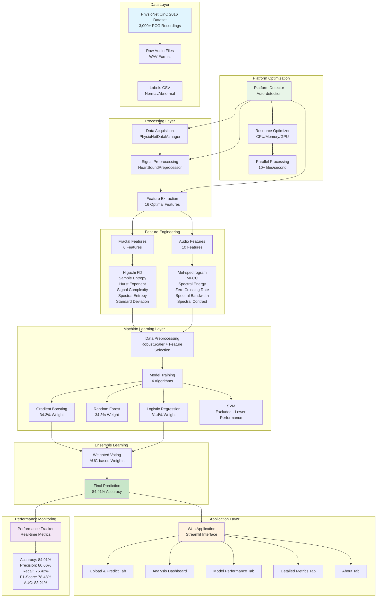

# System Architecture Diagram

## VHD Detection System - Overall Architecture

This diagram shows the complete system architecture of the VHD Detection System, including all major components and their interactions.

## Key Components:

1. **Data Layer**: PhysioNet CinC 2016 dataset with 3,000+ PCG recordings
2. **Processing Layer**: Signal preprocessing and feature extraction
3. **Feature Engineering**: 16 optimal features (6 fractal + 10 audio)
4. **Machine Learning**: Ensemble of 3 algorithms with weighted voting
5. **Application Layer**: Streamlit web interface with 5 main tabs
6. **Performance Monitoring**: Real-time metrics tracking
7. **Platform Optimization**: Automatic platform detection and optimization

## Performance Metrics:
- **Accuracy**: 84.91% ± 1.23%
- **Processing Speed**: 10+ files/second
- **Features**: 16 optimal features
- **Models**: 3-algorithm ensemble
