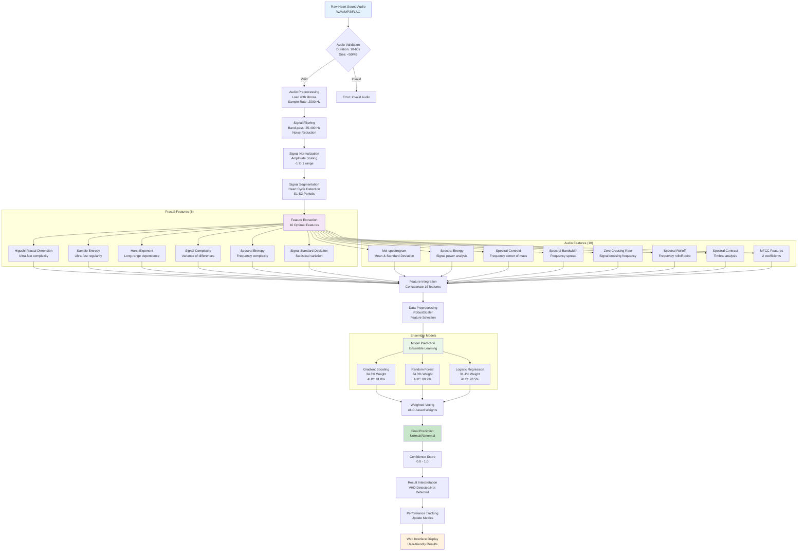

# Machine Learning Pipeline Flowchart

## VHD Detection - Complete ML Pipeline

This diagram illustrates the complete machine learning pipeline from raw audio input to final prediction, showing all processing steps and decision points.

## Pipeline Stages:

### 1. **Input Validation**
- Audio format validation (WAV, MP3, FLAC)
- Duration check (10-60 seconds)
- File size validation (<50MB)

### 2. **Signal Preprocessing**
- Audio loading with librosa
- Band-pass filtering (25-400 Hz)
- Noise reduction and normalization
- Heart cycle segmentation

### 3. **Feature Extraction**
- **Fractal Features (6)**: Signal complexity analysis
- **Audio Features (10)**: Spectral and timbral analysis
- **Total**: 16 optimal features

### 4. **Data Preprocessing**
- RobustScaler for outlier resistance
- Feature selection and validation
- Data normalization

### 5. **Ensemble Prediction**
- 3-algorithm weighted voting
- Performance-based weights
- Final prediction with confidence score

### 6. **Result Processing**
- Prediction interpretation
- Performance tracking
- Web interface display

## Performance Metrics:
- **Processing Speed**: 10+ files/second
- **Accuracy**: 84.91% ± 1.23%
- **Features**: 16 optimal features
- **Models**: 3-algorithm ensemble
