# Feature Extraction Process Diagram

## VHD Detection - Feature Engineering Pipeline

This diagram details the comprehensive feature extraction process, showing how 16 optimal features are extracted from heart sound signals using both fractal and spectral analysis methods.

```mermaid
graph TB
    A[Preprocessed Heart Sound Signal<br/>Filtered & Normalized] --> B[Feature Extraction Pipeline<br/>16 Optimal Features]
    
    subgraph "Fractal Analysis (6 Features)"
        B --> C[Higuchi Fractal Dimension<br/>Ultra-fast complexity measure<br/>k_max=2 for speed]
        B --> D[Sample Entropy<br/>Ultra-fast regularity analysis<br/>m=2, r=0.2]
        B --> E[Hurst Exponent<br/>Ultra-fast long-range dependence<br/>Vectorized operations]
        B --> F[Signal Complexity<br/>Variance of differences<br/>NEW feature]
        B --> G[Spectral Entropy<br/>Frequency domain complexity<br/>NEW feature]
        B --> H[Signal Standard Deviation<br/>Statistical variation measure]
    end
    
    subgraph "Spectral Analysis (10 Features)"
        B --> I[Mel-spectrogram Analysis<br/>Mean & Standard Deviation<br/>4 mels, hop_length=4096]
        B --> J[Spectral Energy<br/>Signal power analysis<br/>FFT-based calculation]
        B --> K[Spectral Centroid<br/>Frequency center of mass<br/>Weighted frequency average]
        B --> L[Spectral Bandwidth<br/>Frequency spread analysis<br/>NEW feature]
        B --> M[Zero Crossing Rate<br/>Signal crossing frequency<br/>Temporal analysis]
        B --> N[Spectral Rolloff<br/>Frequency rolloff point<br/>85% energy threshold]
        B --> O[Spectral Contrast<br/>Timbral analysis<br/>NEW feature]
        B --> P[MFCC Features<br/>2 coefficients<br/>Mel-frequency cepstral]
    end
    
    subgraph "Feature Processing"
        C --> Q[Feature Vector Assembly<br/>16-dimensional array]
        D --> Q
        E --> Q
        F --> Q
        G --> Q
        H --> Q
        I --> Q
        J --> Q
        K --> Q
        L --> Q
        M --> Q
        N --> Q
        O --> Q
        P --> Q
    end
    
    Q --> R[Feature Validation<br/>Check for NaN/Inf values]
    R --> S[Feature Scaling<br/>RobustScaler normalization]
    S --> T[Feature Selection<br/>16 optimal features]
    T --> U[Final Feature Vector<br/>Ready for ML models]
    
    subgraph "Performance Optimization"
        V[Parallel Processing<br/>ThreadPoolExecutor] --> W[Vectorized Operations<br/>NumPy optimizations]
        W --> X[Memory Management<br/>Batch processing]
        X --> Y[Speed Achievement<br/>10+ files/second]
    end
    
    subgraph "Feature Categories"
        Z[Complexity Features<br/>Fractal dimension, entropy]
        AA[Statistical Features<br/>Mean, std, variance]
        AB[Spectral Features<br/>Frequency domain analysis]
        AC[Temporal Features<br/>Time-based characteristics]
    end
    
    C --> Z
    D --> Z
    E --> Z
    F --> Z
    G --> Z
    H --> AA
    I --> AA
    J --> AB
    K --> AB
    L --> AB
    M --> AC
    N --> AB
    O --> AB
    P --> AB
    
    V --> B
    W --> B
    X --> B
    
    style A fill:#e3f2fd
    style B fill:#f3e5f5
    style Q fill:#e8f5e8
    style U fill:#c8e6c9
    style Y fill:#fff3e0
```



## Feature Categories:

### **Fractal Features (6) - Signal Complexity**
1. **Higuchi Fractal Dimension**: Measures signal complexity and irregularity
2. **Sample Entropy**: Quantifies signal regularity and predictability
3. **Hurst Exponent**: Analyzes long-range dependence in the signal
4. **Signal Complexity**: NEW - Variance of differences for complexity
5. **Spectral Entropy**: NEW - Frequency domain complexity measure
6. **Signal Standard Deviation**: Statistical variation in the signal

### **Audio Features (10) - Spectral Analysis**
1. **Mel-spectrogram Mean/Std**: Time-frequency representation
2. **Spectral Energy**: Signal power analysis
3. **Spectral Centroid**: Frequency center of mass
4. **Spectral Bandwidth**: NEW - Frequency spread analysis
5. **Zero Crossing Rate**: Signal crossing frequency
6. **Spectral Rolloff**: Frequency rolloff point
7. **Spectral Contrast**: NEW - Timbral analysis
8. **MFCC Features (2)**: Mel-frequency cepstral coefficients

## Performance Optimizations:

### **Speed Optimizations**
- **Ultra-fast algorithms**: Reduced parameters for speed
- **Vectorized operations**: NumPy optimizations
- **Parallel processing**: Multi-threaded extraction
- **Batch processing**: Efficient memory usage

### **Feature Selection Criteria**
- **Statistical significance**: F-test for feature importance
- **Correlation analysis**: Remove redundant features
- **Performance validation**: Cross-validation testing
- **Optimal count**: 16 features for best accuracy/speed trade-off

## Technical Implementation:

### **Fractal Analysis**
```python
# Ultra-fast Higuchi FD
def ultra_fast_higuchi_fd(signal, k_max=2):
    # Vectorized operations for speed
    # Reduced k_max for performance vs accuracy trade-off

# Ultra-fast Sample Entropy
def ultra_fast_sample_entropy(signal, m=2, r=0.2):
    # Optimized with reduced search space
    # Vectorized distance calculations
```

### **Spectral Analysis**
```python
# Optimized Mel-spectrogram
mel_spec = librosa.feature.melspectrogram(
    y=signal, sr=sample_rate, n_mels=4, hop_length=4096
)
# Optimized parameters: 4 mels, large hop_length for speed
```

## Results:
- **Total Features**: 16 optimal features
- **Processing Speed**: 10+ files/second
- **Accuracy Impact**: +2.51% improvement over baseline
- **Memory Efficiency**: Optimized for large-scale processing
