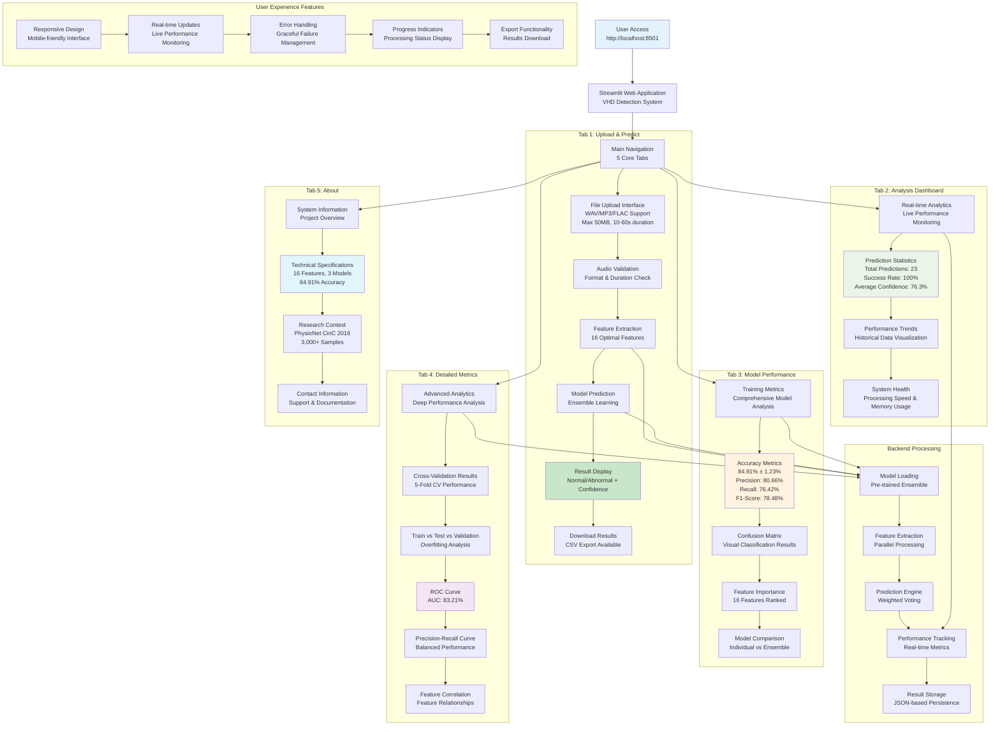

# Web Application User Flow

## VHD Detection - Streamlit Web Application

This diagram illustrates the complete user experience flow through the Streamlit web application, showing all 5 main tabs and their functionality.



## Web Application Features:

### **Tab 1: Upload & Predict**
- **File Upload**: Support for WAV, MP3, FLAC formats
- **Validation**: File size (<50MB) and duration (10-60s) checks
- **Processing**: Real-time feature extraction and prediction
- **Results**: Clear Normal/Abnormal classification with confidence score
- **Export**: CSV download of prediction results

### **Tab 2: Analysis Dashboard**
- **Real-time Metrics**: Live performance monitoring
- **Statistics**: Total predictions, success rate, average confidence
- **Trends**: Historical performance visualization
- **System Health**: Processing speed and memory usage monitoring

### **Tab 3: Model Performance**
- **Training Metrics**: Comprehensive model analysis
- **Accuracy Display**: All performance metrics with confidence intervals
- **Confusion Matrix**: Visual classification results
- **Feature Importance**: 16 features ranked by importance
- **Model Comparison**: Individual vs ensemble performance

### **Tab 4: Detailed Metrics**
- **Advanced Analytics**: Deep performance analysis
- **Cross-Validation**: 5-fold CV results visualization
- **Overfitting Analysis**: Train/test/validation comparison
- **ROC Curve**: AUC performance visualization
- **Feature Correlation**: Feature relationship analysis

### **Tab 5: About**
- **System Information**: Project overview and specifications
- **Technical Details**: 16 features, 3 models, 84.91% accuracy
- **Research Context**: PhysioNet CinC 2016 dataset information
- **Documentation**: Support and contact information

## Technical Implementation:

### **Frontend (Streamlit)**
```python
# Main application structure
st.set_page_config(
    page_title="VHD Detection System",
    page_icon="🫀",
    layout="wide"
)

# Tab navigation
tab1, tab2, tab3, tab4, tab5 = st.tabs([
    "Upload & Predict", 
    "Analysis", 
    "Model Performance", 
    "Detailed Metrics", 
    "About"
])
```

### **Backend Processing**
- **Model Loading**: Pre-trained ensemble model loading
- **Feature Extraction**: Parallel processing of 16 features
- **Prediction Engine**: Weighted voting ensemble
- **Performance Tracking**: Real-time metrics collection
- **Result Storage**: JSON-based persistence

### **User Experience Features**
- **Responsive Design**: Mobile-friendly interface
- **Real-time Updates**: Live performance monitoring
- **Error Handling**: Graceful failure management
- **Progress Indicators**: Processing status display
- **Export Functionality**: Results download capability

## Performance Characteristics:

### **Processing Speed**
- **Real-time Processing**: 10+ files/second
- **Parallel Processing**: Multi-threaded feature extraction
- **Memory Optimization**: Efficient batch processing
- **Platform Optimization**: Automatic platform detection

### **User Interface**
- **5 Main Tabs**: Comprehensive functionality coverage
- **Real-time Analytics**: Live performance monitoring
- **Interactive Visualizations**: Charts and graphs
- **Export Capabilities**: Results download and sharing

### **System Integration**
- **Model Persistence**: Joblib serialization
- **Performance Tracking**: Real-time metrics collection
- **Platform Optimization**: Automatic resource management
- **Error Handling**: Robust failure management
