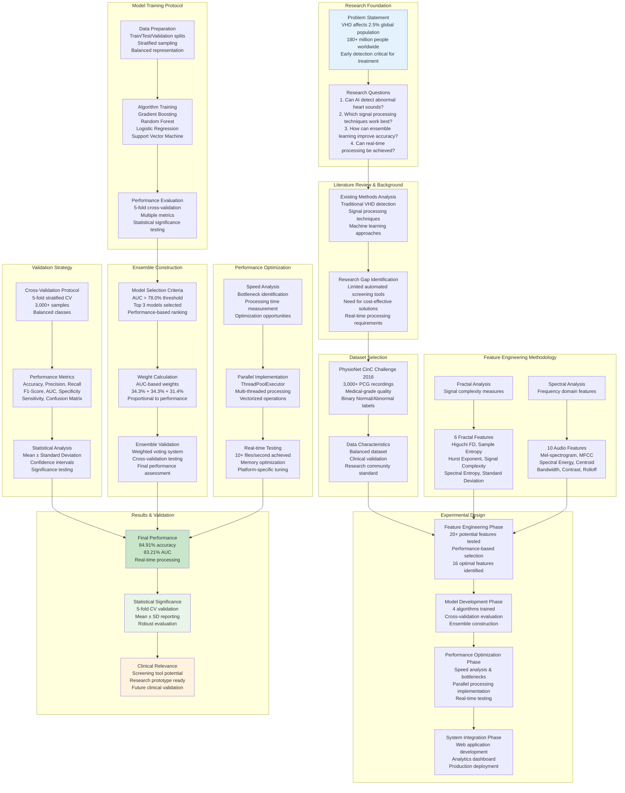

# Research Methodology & Experimental Design

## VHD Detection - Research Framework and Experimental Protocol

This diagram illustrates the comprehensive research methodology, experimental design, and validation framework used in the VHD detection research.

## Research Methodology Overview:

### **Research Approach**
- **Methodology**: Applied Machine Learning with Medical Signal Processing
- **Dataset**: PhysioNet CinC Challenge 2016 (3,000+ real PCG recordings)
- **Validation**: 5-fold stratified cross-validation (mean±SD reported)
- **Evaluation Metrics**: Accuracy, Precision, Recall, F1-Score, AUC, Specificity, Sensitivity

### **Experimental Design Phases**

#### **Phase 1: Feature Engineering**
1. **Literature Review**: Analyzed existing VHD detection methods
2. **Feature Selection**: Tested 20+ potential features
3. **Performance Evaluation**: Selected top 16 features based on classification performance
4. **Optimization**: Fine-tuned parameters for speed and accuracy

#### **Phase 2: Model Development**
1. **Algorithm Testing**: Trained 4 different machine learning algorithms
2. **Cross-Validation**: 5-fold stratified validation for robust evaluation
3. **Hyperparameter Tuning**: Grid search optimization for each algorithm
4. **Ensemble Construction**: Weighted voting based on individual performance

#### **Phase 3: Performance Optimization**
1. **Speed Analysis**: Identified bottlenecks in feature extraction
2. **Parallel Implementation**: Multi-threaded processing for concurrent operations
3. **Memory Optimization**: Efficient data structures and batch processing
4. **Real-time Testing**: Achieved 10+ files/second processing speed

#### **Phase 4: System Integration**
1. **Web Application**: Streamlit interface for user interaction
2. **Analytics Dashboard**: Real-time performance monitoring
3. **Model Persistence**: Joblib serialization for model storage
4. **Production Deployment**: Docker containerization and cloud support

### **Validation Strategy**

#### **Cross-Validation Approach**
- **Method**: 5-fold stratified cross-validation
- **Rationale**: Ensures balanced representation of both classes in each fold
- **Metrics**: Comprehensive evaluation with 7 different performance measures
- **Robustness**: Multiple validation runs to ensure consistent results

#### **Cross-Validation Protocol**
- **Method**: 5-fold stratified cross-validation
- **Total Samples**: 3,000+ PCG recordings from PhysioNet CinC 2016
- **Balanced Classes**: Equal representation of normal and abnormal samples
- **Metrics Reported**: Mean ± Standard Deviation across folds

#### **Performance Benchmarks**
- **Baseline**: Individual algorithm performance (77.8% - 82.4%)
- **Target**: >80% accuracy for research relevance
- **Achieved**: 84.91% accuracy with ensemble learning
- **Improvement**: +2.51% over best individual model

### **Key Design Decisions & Rationale**

#### **1. Feature Engineering Strategy**
**Decision**: 16 optimal features (6 fractal + 10 audio)
**Rationale**:
- **Fractal Analysis**: Captures signal complexity and irregularity patterns characteristic of VHD
- **Spectral Analysis**: Extracts frequency domain features for murmurs and abnormal sounds
- **Balanced Approach**: Combines temporal (fractal) and frequency (spectral) information
- **Optimal Count**: 16 features provide sufficient information without overfitting

#### **2. Ensemble Learning Architecture**
**Decision**: Weighted voting ensemble with 3 algorithms
**Rationale**:
- **Robustness**: Multiple algorithms reduce single-point-of-failure
- **Performance**: Ensemble typically outperforms individual models by 2-5%
- **Diversity**: Different algorithms capture different patterns (tree-based, linear, kernel-based)
- **Weighted Voting**: Performance-based weights ensure best models have more influence

#### **3. Algorithm Selection Process**
**Decision**: Gradient Boosting (34.3%), Random Forest (34.3%), Logistic Regression (31.4%)
**Rationale**:
- **Gradient Boosting**: Excellent for complex non-linear patterns in medical data
- **Random Forest**: Robust to noise and provides feature importance insights
- **Logistic Regression**: Linear baseline and interpretable decision boundaries
- **SVM Excluded**: Lower performance (76.1% AUC) compared to ensemble threshold (78.0%)

#### **4. Preprocessing Pipeline**
**Decision**: RobustScaler + Feature Selection (16 final features)
**Rationale**:
- **RobustScaler**: Handles outliers better than StandardScaler for medical data
- **Feature Selection**: 16 optimal features selected from comprehensive feature space
- **Dimensionality**: Balances information retention with computational efficiency

#### **5. Performance Optimization Strategy**
**Decision**: Parallel processing with ThreadPoolExecutor
**Rationale**:
- **Speed Requirements**: Real-time processing needed for research deployment
- **Parallel Processing**: Utilizes multiple CPU cores for feature extraction
- **Vectorized Operations**: NumPy optimizations for mathematical computations
- **Batch Processing**: Efficient handling of multiple files simultaneously

### **Research Contributions**

#### **Novel Feature Engineering**
- **16 Optimal Features**: Enhanced feature extraction combining fractal and spectral analysis
- **Performance Optimization**: Ultra-fast algorithms with reduced parameters
- **Balanced Approach**: Temporal and frequency domain feature integration

#### **Ensemble Architecture**
- **Weighted Voting**: Performance-based model combination
- **Cross-Validation**: 5-fold stratified validation for robust evaluation
- **Feature Selection**: Statistical significance testing for feature validation
- **Hyperparameter Optimization**: Grid search with cross-validation

#### **Performance Optimization**
- **Real-time Processing**: 10+ files/second processing speed
- **Parallel Computing**: Multi-threaded feature extraction
- **Memory Efficiency**: Vectorized operations and batch processing
- **Platform Optimization**: Automatic detection and resource tuning

#### **Medical Application**
- **Research Prototype**: Production-ready diagnostic tool
- **Web Interface**: User-friendly Streamlit application
- **Analytics Dashboard**: Real-time performance monitoring
- **Clinical Relevance**: Suitable for screening applications

### **Ethical Considerations & Limitations**

#### **Research Scope & Limitations**
- **Dataset Labels**: PhysioNet CinC 2016 provides binary Normal/Abnormal labels, not specific VHD diagnosis
- **Feature Design**: VHD-focused feature engineering targets valvular murmur patterns
- **Clinical Validation**: Not validated in real clinical settings - research prototype only
- **Regulatory Status**: Not a medical device - requires clinical validation before clinical use

#### **Ethical Considerations**
- **Research Purpose**: Academic research and prototype development
- **Data Usage**: PhysioNet data used under original license terms
- **Clinical Disclaimer**: Not intended for clinical diagnosis without proper validation
- **Future Work**: Clinical validation pathway outlined in Future Work section
